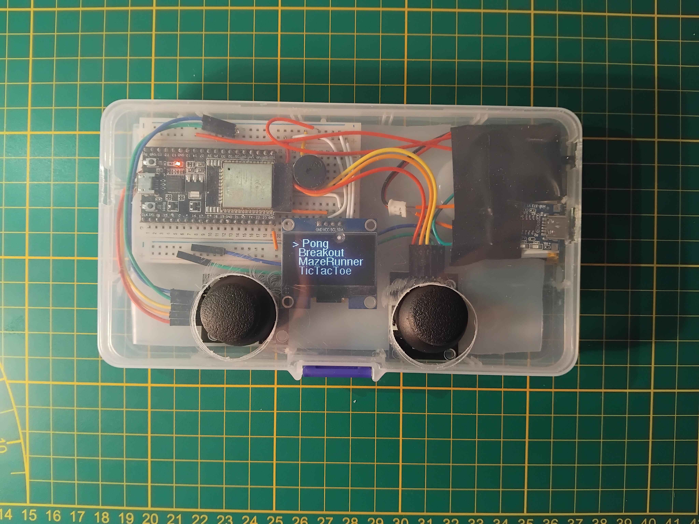

# Retro Game Console

The goal was to build a compact device that combines a retro gaming experience with modern electronics. The console features its own graphical user interface (menu) and four playable games.

## Technical Specifications

* **Microcontroller:** ESP32 (a more powerful successor to the original Arduino UNO).
* **Display:** 128x64 px OLED display (I2C communication).
* **Controls:** 2 analog joysticks for smooth gameplay.
* **Sound:** Passive buzzer for retro sound effects.
* **Power:** 3.7V battery with a power switch and a TP4056 USB-C charging module for portability.
* **Enclosure:** Designed to house the breadboard components and allow smooth control via the joysticks.

## Games

* **Pong:** The classic table game for two players.
* **Breakout:** Smash bricks with a bouncing ball.
* **MazeRunner:** Find your way through a maze (the maze keeps changing).
* **TicTacToe:** The classic **Tic-Tac-Toe** logic game for one or two players.

## Required Libraries (Arduino IDE):

* **Adafruit GFX Library**
* **Adafruit SH110X**
* **U8g2** by oliver <olikraus@gmail.com>
